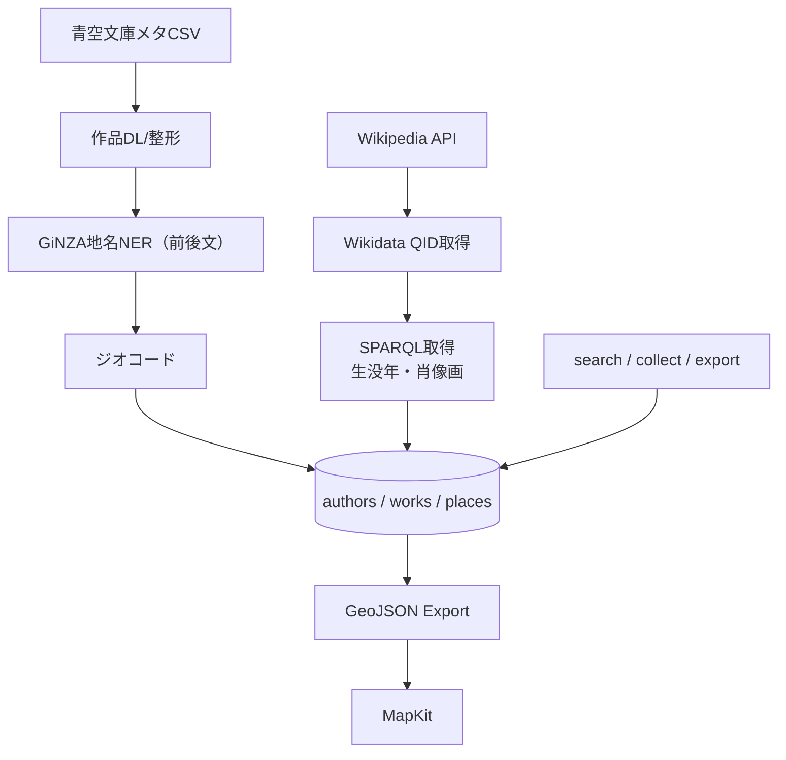

# 文豪ゆかり地図システム  
**統一再設計仕様書（v3.0）**  
*2025-06-04 更新*

---

## 1. 目的・概要

文豪の作品に登場する地名を可視化し、作者・作品・舞台のつながりを地図で直感的に把握できる「文豪ゆかり地図システム」を構築する。  
青空文庫とWikidataを主要ソースとし、**検索性・拡張性・可視化対応**を重視した構成で再設計する。

---

## 2. システム構成図

---

## 3. データモデル

### 3.1 authors テーブル

| 列名 | 型 | 内容 |
|------|----|------|
| author_id | INT | 主キー |
| name | TEXT | 著者名（青空文庫ベース） |
| wiki_title | TEXT | Wikipediaページ名 |
| description | TEXT | 概要文（Wikipedia summary） |
| wikidata_qid | TEXT | Wikidata QID（例: Q160566） |
| birth_year | INT | 生年（西暦） |
| death_year | INT | 没年（西暦 or NULL） |
| portrait_url | TEXT | Wikimedia Commons画像URL |
| updated_at | TEXT | 更新日時（ISO8601） |

### 3.2 works テーブル

| 列名 | 型 | 内容 |
|------|----|------|
| work_id | INT | 主キー |
| author_id | INT | 外部キー（authors） |
| title | TEXT | 作品タイトル |
| aozora_url | TEXT | 図書カードURL |
| updated_at | TEXT | 更新日時 |

### 3.3 places テーブル

| 列名 | 型 | 内容 |
|------|----|------|
| place_id | INT | 主キー |
| work_id | INT | 外部キー（works） |
| place_name | TEXT | 地名 |
| lat | REAL | 緯度 |
| lng | REAL | 経度 |
| before | TEXT | 地名の前の文 |
| sentence | TEXT | 地名を含む文 |
| after | TEXT | 地名の次の文 |
| updated_at | TEXT | 更新日時 |

---

## 4. データ取得フロー

### 4.1 青空文庫（作品と地名）

1. メタCSV（ZIP）をダウンロード  
2. 著作権フラグ=0 の作品を対象にテキスト取得  
3. ルビ・注記を除去（正規化）  
4. GiNZAで地名抽出 → 前後1文取得  
5. placesへ登録、座標はジオコード処理へ  

### 4.2 Wikipedia + Wikidata（作者情報）

1. Wikipedia API で `pageprops.wikibase_item` を取得（QID）  
2. Wikidata SPARQLで生年・没年・肖像画を取得  
3. authors テーブルに統合登録  

---

## 5. モジュール一覧

| モジュール | 概要 |
|------------|------|
| `aozora_utils.py` | カタログ取得、本文DLと正規化 |
| `aozora_place_extract.py` | GiNZAによる地名と前後文抽出 |
| `geocode_utils.py` | 地名の緯度経度取得（geopy+GoogleMaps） |
| `author_enrich.py` | Wikipedia→QID→SPARQLで作者バイオ取得 |
| `db_utils.py` | SQLiteまたはSheets対応のCRUD |
| `search.py` | 作者／作品／地名 検索CLI |
| `collect.py` | データ全体収集CLI |
| `export_geojson.py` | MapKit用GeoJSON出力 |

---

## 6. CLIコマンド仕様

| コマンド | 機能 |
|----------|------|
| `bungo collect` | 青空文庫とWikidataを両方クロールしDB更新 |
| `bungo search author <名前>` | 著者名検索で作品一覧表示 |
| `bungo search work <作品名>` | 作品に含まれる地名＋抜粋文表示 |
| `bungo search place <地名>` | 地名から作者・作品を逆引き |
| `bungo export geojson` | 全地名をGeoJSON化して保存 |

---

## 7. 出力仕様（GeoJSON）

- `FeatureCollection` にて各地名ごとに1ピン  
- `properties` 内には以下を格納：
  - `title`: 地名
  - `subtitle`: 作者 + 作品名
  - `excerpt`: 前文｜地名文｜後文
  - `author`: 著者名
  - `portrait_url`: 肖像画（オプション）
  - `source_url`: 図書カードURL

---

## 8. テスト・CI戦略

- pytest + flake8 + mypy による静的解析
- 著者1人での統合試験（collect → search → export）
- CI（GitHub Actions）で自動チェック

---

## 9. 今後の拡張（Optional）

| 項目 | 内容 |
|------|------|
| GPT-4による地名の舞台判定 | 作中で実際に舞台として機能しているかの真偽判定 |
| 差分同期API | Firebase or Cloud Functionsで更新差分配信 |
| 地名同定スコア | tf-idfや登場頻度ベースで重要度を付与 |
| 多言語対応 | Wikidata経由で多言語ラベルを取得（翻訳向け）

---

## 10. 完了条件（Done）

- authors / works / places の3テーブル整備完了
- 主要文豪（30人）＋代表作品（500件）地名抽出済み
- `search` で双方向検索動作
- `export_geojson` が1万件以上のピンを含み、iOS描画成功
- CIテストが通過し、更新が安定運用可能

---

## まとめ

本仕様は、青空文庫とWikidataを主ソースとした「文豪・作品・地名」統合マップシステムを、検索性・整合性・拡張性の観点から再設計したものである。  
本設計により、作品舞台の地理的可視化と、文学史的理解を促進する新しい教材・読書体験の提供が可能となる。
