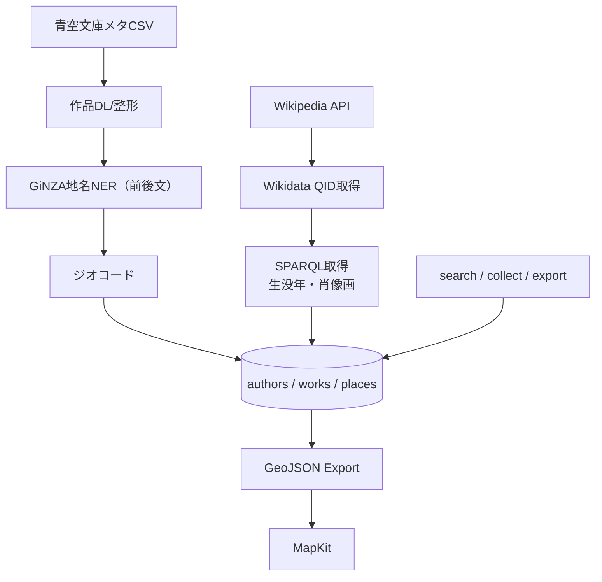

# 文豪ゆかり地図システム v4 プロジェクト概要

## 1. プロジェクトの目的

文豪の作品に登場する地名を可視化し、作者・作品・舞台のつながりを地図で直感的に把握できる「文豪ゆかり地図システム」を構築する。
青空文庫とWikidataを主要ソースとし、**検索性・拡張性・可視化対応**を重視した構成で実装する。

## 2. システム構成

### 2.1 主要コンポーネント



### 2.2 ディレクトリ構造

```
bungo-map-v4/
├── src/
│   └── bungo_map/
│       ├── ai/
│       │   ├── geocoder/
│       │   │   ├── place_geocoder.py      # 地名ジオコーディング
│       │   │   └── context_aware_geocoder.py  # 文脈考慮ジオコーディング
│       │   └── ai_manager.py              # AI機能管理
│       ├── database/
│       │   ├── models.py                  # データベースモデル
│       │   └── schema_manager.py          # スキーマ管理
│       └── extractors/
│           ├── place_extractor.py         # 地名抽出
│           └── extraction_pipeline.py     # 抽出パイプライン
├── tests/
│   └── test_context_aware_geocoder.py     # テスト
└── docs/
    └── project_overview.md                # 本ドキュメント
```

## 3. 主要機能

### 3.1 データ取得・処理フロー

1. 青空文庫からの作品取得
   - メタCSV（ZIP）をダウンロード
   - 著作権フラグ=0 の作品を対象にテキスト取得
   - ルビ・注記を除去（正規化）

2. 地名抽出・処理
   - GiNZAによる地名抽出
   - 前後文の取得
   - 文脈分析による地名/人名の判別
   - 歴史的文脈の検出
   - 曖昧地名の解決

3. ジオコーディング
   - ローカルDB検索
   - 部分一致検索
   - 座標変換

4. データベース保存
   - 地名情報の保存
   - 作品情報の保存
   - 関連付け

### 3.2 データモデル

#### authors テーブル
- author_id: 主キー
- name: 著者名
- wiki_title: Wikipediaページ名
- description: 概要文
- wikidata_qid: Wikidata QID
- birth_year: 生年
- death_year: 没年
- portrait_url: 肖像画URL

#### works テーブル
- work_id: 主キー
- author_id: 外部キー
- title: 作品タイトル
- aozora_url: 図書カードURL

#### places テーブル
- place_id: 主キー
- work_id: 外部キー
- place_name: 地名
- lat: 緯度
- lng: 経度
- before: 前文
- sentence: 地名を含む文
- after: 後文

## 4. 現在の実装状況

### 4.1 完了した機能
- 文脈を考慮したジオコーディング
  - 地名/人名の判別
  - 歴史的文脈の検出
  - 詳細な地名データベース
- AI機能管理システム
  - OpenAI API統合
  - 地名データ品質分析
  - 統計情報の管理

### 4.2 進行中の機能
- 青空文庫からの作品取得
- 地名抽出パイプライン
- データベース管理システム

### 4.3 今後の課題
- GPT-4による地名の舞台判定
- 差分同期APIの実装
- 地名同定スコアの実装
- 多言語対応

## 5. 品質管理

### 5.1 テスト戦略
- pytest + flake8 + mypy による静的解析
- 著者1人での統合試験
- CI（GitHub Actions）で自動チェック

### 5.2 完了条件
- authors / works / places の3テーブル整備完了
- 主要文豪（30人）＋代表作品（500件）地名抽出済み
- 検索機能の双方向動作
- GeoJSON出力が1万件以上のピンを含み、iOS描画成功
- CIテストが通過し、更新が安定運用可能

## 6. 今後の展望

1. 機能拡張
   - 舞台判定の精度向上
   - リアルタイム更新機能
   - 多言語対応

2. パフォーマンス改善
   - データベース最適化
   - キャッシュ戦略の実装
   - APIレスポンスの高速化

3. ユーザー体験向上
   - インタラクティブな地図表示
   - 作品との連携強化
   - ソーシャル機能の追加 